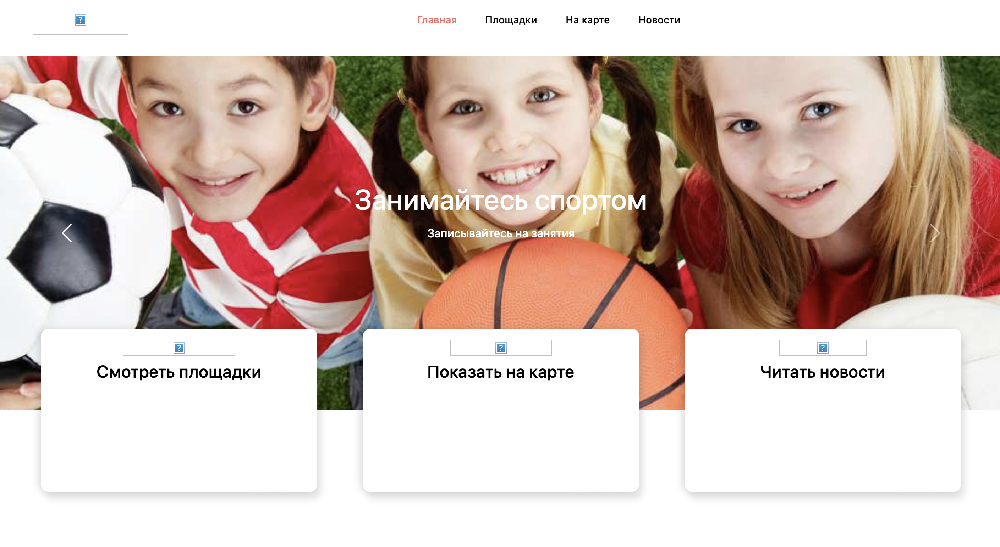
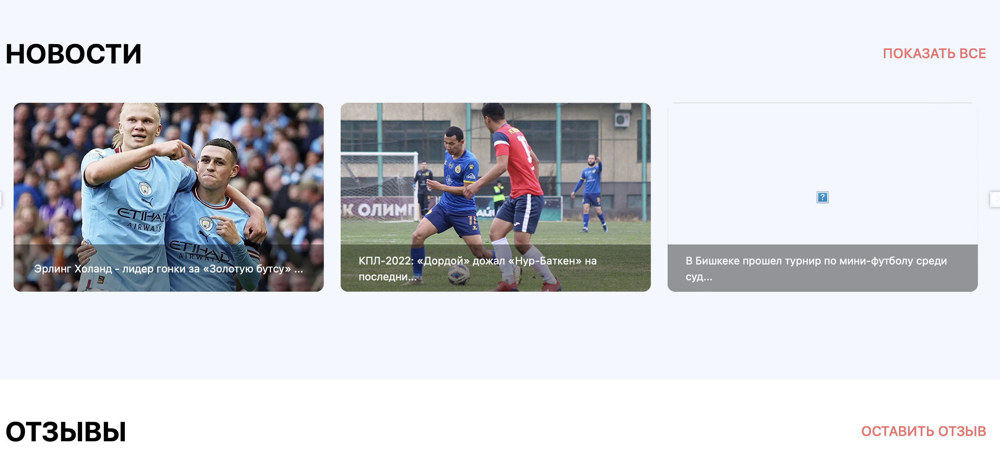
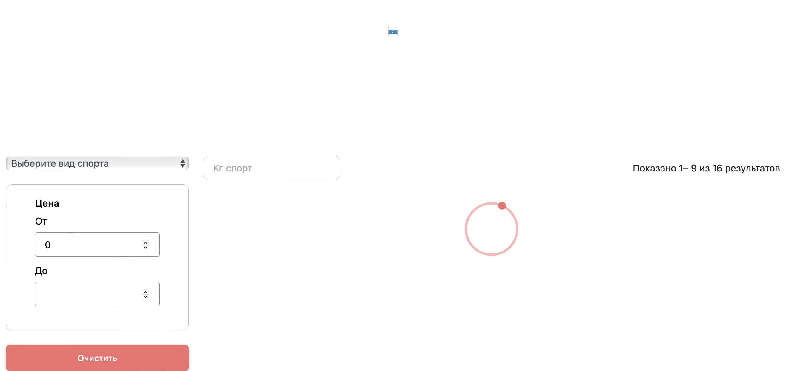

<h1 align="center">Hi 👋, I'm Maksatbek Yrysbaev</h1>
<h3 align="center">A passionate Mobile and Web developer from Kyrgyzstan</h3>

- 🔭 I’m currently working on [My first professional project](https://github.com/Yrysbaev/Web_project.git)

- I have some problems with img in my project but I will fix it soon.

- And You can aslo find the place that you want. 

- 🌱 I’m currently learning **HTML and CSS and Javascript**

- 📫 How to reach me **mzamirbekovic02@gmail.com**

<h3 align="left">Connect with me:</h3>

<h3 align="left">Languages and Tools:</h3>

           

